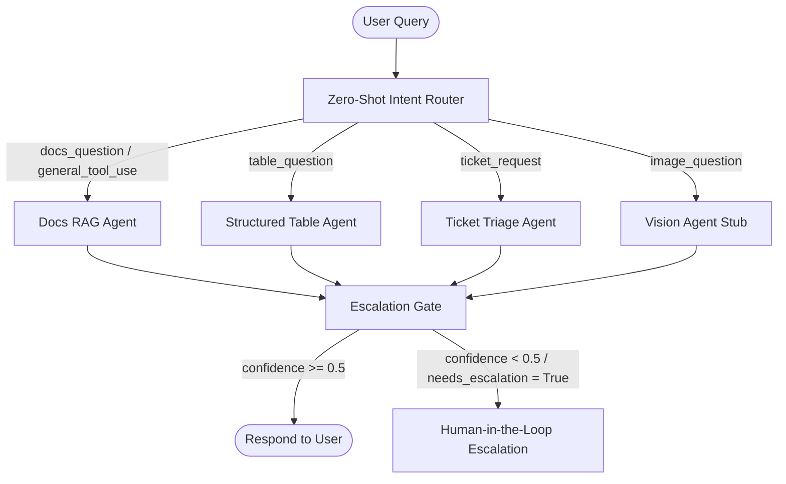

# Athena Enterprise Copilot

Athena is a multi-agent enterprise copilot orchestrator powered by **LangGraph** and **Groq Cloud LLMs**. It integrates local dense/sparse hybrid search retrieval, tabular data analysis, and support ticket triage into a unified, confidence-gated agentic workflow.

---

## Architecture Overview



### Components

1. **Zero-Shot Intent Router (`agents/router.py`)**: Uses Groq (`llama-3.1-8b-instant`) to classify the user's query intent into one of five categories (`docs_question`, `table_question`, `image_question`, `ticket_request`, `general_tool_use`).
2. **Docs RAG Agent (`agents/docs_rag_agent.py`)**: Retrieves context using Phase 1 Hybrid Search, compiles a grounded prompt, and calls `llama-3.3-70b-versatile` on Groq to synthesize an answer with inline source citations.
3. **Table Analysis Agent (`agents/table_agent.py`)**: Translates queries into single-line Pandas expressions, evaluates them on an asset inventory database (`data/sample_table.csv`), and returns the results.
4. **Ticket Triage Agent (`agents/ticket_agent.py`)**: Automatically evaluates support requests and returns a structured JSON payload containing priority (`low`, `medium`, `high`, `urgent`) and routing recommendations.
5. **Vision Agent Stub (`agents/vision_agent.py`)**: A placeholder node routing image queries to a "not implemented" state for future expansion.
6. **Escalation Gate (`orchestrator/graph.py`)**: If the responding agent's confidence drops below `0.5` (such as a low-scoring RAG match or a calculation error), it flags the state as `needs_escalation = True` to invoke a human administrator.

---

## Setup & Running

### 1. Prerequisites
Make sure Python 3.10+ is installed on your machine.

### 2. Installation
Clone the repository and set up the virtual environment:
```bash
git clone https://github.com/Ibrahimbathusha73/athena.git
cd athena
python3 -m venv venv
source venv/bin/activate
pip install -r requirements.txt
```

### 3. Environment Variables
Copy `.env.example` to `.env` and add your Groq API key:
```bash
cp .env.example .env
```
*Modify `.env` to include your actual API keys:*
```ini
GROQ_API_KEY=gsk_your_actual_groq_key_here
GOOGLE_API_KEY=your_google_api_key_here
```

### 4. Data Ingestion & Vector Indexing
Athena uses issues from `huggingface/transformers` to populate its knowledge base:
```bash
# Fetch raw issues from GitHub
python ingestion/fetch_github_issues.py

# Chunk text and embed into ChromaDB vector database
python ingestion/chunk_and_embed.py
```

---

## Testing

Athena comes with two automated test suites to verify retrieval and multi-agent routing:

### Run Retrieval Tests
Validates dense/sparse indexing, semantic retrieval, and cross-encoder reranking:
```bash
PYTHONPATH=. pytest tests/test_hybrid_search.py -v
```

### Run Orchestration Tests
Validates the zero-shot router classification, pandas execution, ticket triage, and low-confidence escalation:
```bash
PYTHONPATH=. pytest tests/test_orchestrator.py -v
```
